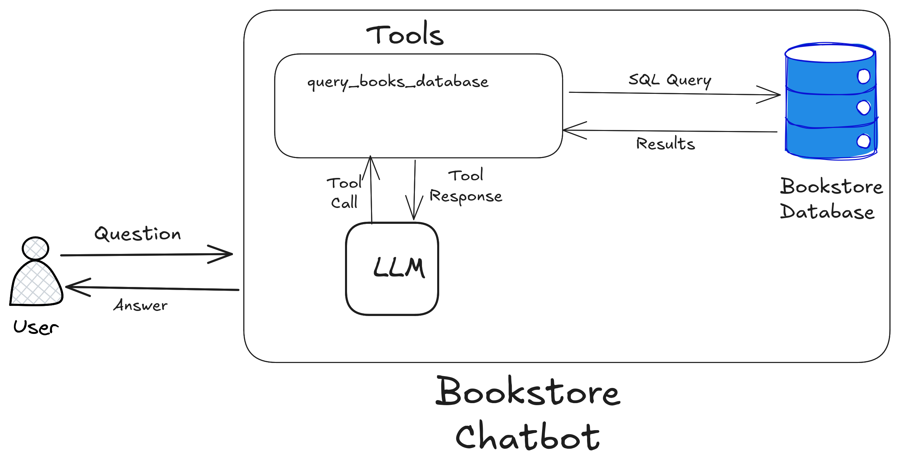

# Bookstore Chatbot
A chatbot to ask questions about products in an online bookstore.
https://huggingface.co/spaces/amgadhasan/bookstore-chatbot

## Architecture
The solution uses the following components:
1. LLM: This is the main component of the solution. It interacts with the user and has access to tools to get needed data to answer the question
2. Bookstore database: This is a SQL database created from the scraped data. It contains all the information about the books like price, quantity, category etc. It can be utilized using read-only SQL queries. 
3. Tools: We have one tool that allows the LLM to query the books database.
4. Chat interface: This is a web UI that exposes a chat interface with the LLM.

When the user asks the chatbot a question, the LLM is instructed to help the user with their queries. It can use tools to get relevant data from a SQL database to help guide its answers. The LLM is intructed to provide refernces to its answers by listing the sql queries used to get the data. This is helpful as the user can use the sql queries to check whether the LLM fetched the correct data.



## Challengs
### Unstructured SQL Output
The first version required the LLM to write the sql directly ina normal assistant response. This caused many issues with parsing the response as the LLM can sometimes add an introductory line like "Sure, here is the sql".

##### Solution
Create a tool that takes the sql query. This makes parsing the output much easier.

### Empty SQL Response
Some of the questions required writing sql queries that return no rows (e.g. there are no books that are out of stock). This would cause the LLM to hallucinate and keep querying the database again with a malformed sql query

##### Solution
Instruct the LLM that some sql queries return empty responses as there are no entries for the given query. Additionally, the tool definition is modified to mention that it "Returns `None` if no there are no entries for the provided query"

## Setup
This section explains how to setup and run the project
### 1. Clone the project
```sh
git clone https://github.com/AmgadHasan/store-data-chatbot.git
cd store-data-chatbot
```

### 2. Setup environment variables

You need to setup the following environment variables in a `.env` file
```
# .env
OPENAI_BASE_URL=https://api.groq.com/openai/v1
OPENAI_API_KEY=<your api key here>
CHAT_MODEL=gemma2-9b-it
```

### 3. Installing the project
#### UV

1. Make sure you have installed [uv](https://docs.astral.sh/uv/getting-started/installation/)

2. Install dependencies
```sh
uv sync
```

3. Scrape the data
```sh
uv run python src/scrape.py
```

4. Start the gradio app
Start the gradio app by running:
```sh
uv run python -m src.app
```
This runs the app on localhost

### Docker

1. Install Docker Engine
Make sure you have installed [docker](https://docs.docker.com/engine/install/)

[Optional] Use the run script
The `run.sh` file combines steps 2-4 into one script. You can run it as follows:
```sh
sudo bash run.sh
```

2. Build the docker image
```sh
docker build . -t bookstore-chatbot:latest
```

3. Scrape the data
The following code runs the container to scrape the data. We mount the local `data` folder to save the output data in a persistent manner:
```sh
docker run --user root -v $(pwd)/data:/app/data bookstore-chatbot:latest uv run python src/scrape.py
```

4. Start the gradio app
```sh
docker run -v $(pwd)/data:/app/data -p 7860:7860 --env-file .env bookstore-chatbot:latest
```

## Example answers
### Q: Are there any books in the 'Travel' category that are marked as 'Out of stock'?
#### Answer: 
There are no books in the 'Travel' category that are marked as 'Out of stock'.
#### References: 
SELECT * FROM books WHERE category = 'Travel' AND availability = 'Out of stock' 

______________________________
### Q: Does the 'Mystery' category contain books with a 5-star rating?
#### Answer:
Yes, the 'Mystery' category contains books with a 5-star rating. 

#### References:
```sql
SELECT * FROM books WHERE category = 'Mystery' AND star_rating = 5
```

______________________________
### Q: Are there books in the 'Classics' category priced below £10?
#### Answer: 
There are no books in the 'Classics' category priced below £10. 
#### References: 
SELECT * FROM books WHERE category = 'Classics' AND price < 10 


______________________________
### Q: Are more than 50% of books in the 'Mystery' category priced above £20?
#### Answer: 
Yes, more than 50% of books in the 'Mystery' category are priced above £20. 

#### References:
SELECT COUNT(*) AS num_books, AVG(price) AS avg_price FROM books WHERE category = 'Mystery' AND price > 20 


______________________________
### Q: What is the average price of books across each category?
#### Answer:
The average price of books across each category is as follows:

Academic: 13.12
Add a comment: 35.79641791044776
Adult Fiction: 15.36
Art: 38.519999999999996
Autobiography: 37.053333333333335
Biography: 33.662
Business: 32.46
Childrens: 32.638275862068966
Christian: 42.49666666666666
Christian Fiction: 34.385
Classics: 36.54526315789474
Contemporary: 36.199999999999996
Crime: 10.97
Cultural: 36.58
Default: 34.39269736842105
Erotica: 19.19
Fantasy: 39.59395833333333
Fiction: 36.06661538461539
Food and Drink: 31.414666666666665
Health: 51.4525
Historical: 22.83
Historical Fiction: 33.644230769230774
History: 37.294999999999995
Horror: 35.94941176470588
Humor: 33.501
Music: 35.63692307692308
Mystery: 31.7190625
New Adult: 46.38333333333333
Nonfiction: 34.26018181818182
Novels: 54.81
Paranormal: 15.4
Parenting: 37.35
Philosophy: 33.558181818181815
Poetry: 35.97421052631579
Politics: 53.61333333333332
Psychology: 34.21857142857143
Religion: 32.56714285714286
Romance: 33.93371428571428
Science: 33.08857142857143
Science Fiction: 33.8025
Self Help: 40.620000000000005
Sequential Art: 34.57226666666667
Short Stories: 35.88
Spirituality: 35.098333333333336
Sports and Games: 41.166
Suspense: 58.33
Thriller: 31.433636363636364
Travel: 39.79454545454546
Womens Fiction: 36.79117647058824
Young Adult: 35.449074074074076


#### References:
```sql
SELECT category, AVG(price) AS average_price FROM books GROUP BY category;
```

______________________________
### Q: What is the price range (minimum and maximum) for books in the 'Historical Fiction' category?
#### Answer:
The price range for books in the 'Historical Fiction' category is between $16.62 and $55.55.
#### References:
SELECT MIN(price) AS min_price, MAX(price) AS max_price FROM books WHERE category = 'Historical Fiction'; 


______________________________
### Q: How many books are available in stock across the four categories?
#### Answer: 
The total number of books available in stock across all four categories is 3725. 
#### References:
SELECT SUM(quantity) FROM books GROUP BY category 


______________________________
### Q: What is the total value (sum of prices) of all books in the 'Travel' category?
#### Answer:
The total value of all books in the 'Travel' category is 437.74.
#### References: 
SELECT SUM(price) FROM books WHERE category = 'Travel' 


______________________________
### Q: Which category has the highest average price of books?
#### Answer:
The category with the highest average price of books is Suspense with an average price of 58.33. 
#### References: 
SELECT category, AVG(price) AS average_price FROM books GROUP BY category ORDER BY average_price DESC LIMIT 1 

______________________________
### Q: Which categories have more than 50% of their books priced above £30?
#### Answer:
The following categories have more than 50% of their books priced above £30:
Add a comment, Art, Cultural, Health, New Adult, Novel, Parenting,  Self Help, Sports and Games, Suspense, Travel 

#### References:
```sql
SELECT category, AVG(CASE WHEN price > 30 THEN 1 ELSE 0 END) AS percentage_above_30 FROM books GROUP BY category HAVING AVG(CASE WHEN price > 30 THEN 1 ELSE 0 END) > 0.5;
```

______________________________
### Q: Compare the average description length (in words) across the four categories.
#### Answer: 
The average description length varies across categories. 

Here's a breakdown:

* Academic: 1101.0 words
* Add a comment: 1649.58 words
* Adult Fiction: 1398.0 words
* Art: 1278.88 words 

...

* Young Adult: 1240.67 words 

#### References:
```sql
SELECT category, AVG(LENGTH(description)) AS avg_description_length FROM books GROUP BY category;
```

______________________________
### Q: Which category has the highest percentage of books marked as 'Out of stock'?
#### Answer: The category with the highest percentage of books marked as 'Out of stock' is Young Adult, with 0.0%. 
#### References: 
sql_query: SELECT category, CAST(SUM(CASE WHEN availability = 'Out of stock' THEN 1 ELSE 0 END) AS REAL) * 100 / COUNT(*) AS percentage FROM books GROUP BY category ORDER BY percentage DESC LIMIT 1 